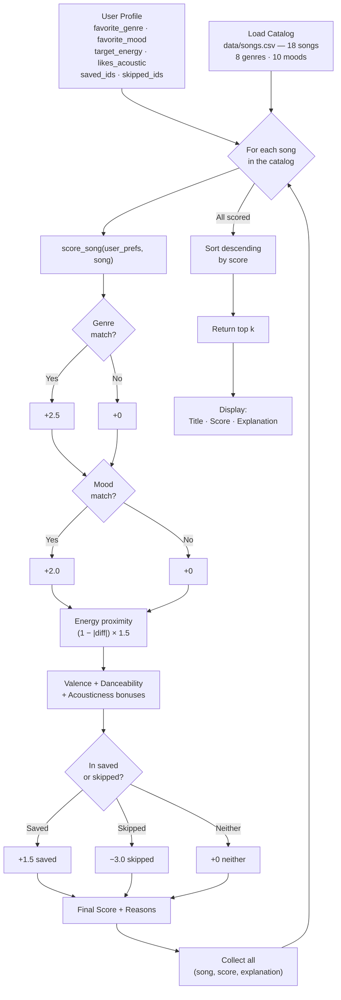

# 🎵 Music Recommender Simulation

## Project Summary

In this project you will build and explain a small music recommender system.

Your goal is to:

- Represent songs and a user "taste profile" as data
- Design a scoring rule that turns that data into recommendations
- Evaluate what your system gets right and wrong
- Reflect on how this mirrors real world AI recommenders

This version builds a hybrid music recommender that combines **content-based filtering** (scoring each song against the user's audio feature preferences) with **collaborative-style behavioral signals** (boosting saved tracks and suppressing skipped ones). It is designed around the same audio feature space that Spotify exposes through its API — energy, valence, danceability, and acousticness — so the scoring logic mirrors how real production recommenders work at a conceptual level. The system prioritizes genre and mood as the strongest intent signals, then uses continuous proximity scoring on numeric features to reward songs that are *closest* to the user's preference rather than simply above or below a threshold.

---

## How The System Works

Explain your design in plain language.

Some prompts to answer:

- What features does each `Song` use in your system
  - For example: genre, mood, energy, tempo
- What information does your `UserProfile` store
- How does your `Recommender` compute a score for each song
- How do you choose which songs to recommend

You can include a simple diagram or bullet list if helpful.

### How Real-World Recommendations Work — and What This Version Prioritizes

Real-world recommenders like Spotify and YouTube Music work in two stages. First, a **scoring rule** evaluates every song individually against what a user has shown they like — comparing audio features, listening history, and behavioral signals like saves and skips. Second, a **ranking rule** sorts all those scores and surfaces the top results. This simulation follows the same two-stage design. The scoring layer uses a weighted formula inspired by Spotify's audio-feature API: categorical matches (genre, mood) give a large fixed bonus because they reflect the strongest user intent, while numeric features (energy, valence, danceability, acousticness) use **proximity scoring** — `(1 - |song_value - user_target|) × weight` — so songs *closest* to the user's preference score higher rather than songs simply above or below a threshold. A behavioral layer then adjusts scores using explicit signals: previously saved songs receive a boost, and previously skipped songs receive a suppression penalty large enough to override any content score. The ranking rule sorts all scored songs descending and returns the top `k`.

This version prioritizes **genre and mood** as the strongest intent signals (a user asking for "lofi" or "chill" is expressing a use-case, not just a number), followed by **energy proximity** as the most discriminating continuous feature, then **valence**, **danceability**, and **acousticness** as secondary texture signals.

---

### `Song` Features

Each song is a dataclass with these attributes drawn from `data/songs.csv`:

| Feature | Type | Range | What It Captures |
|---|---|---|---|
| `id` | int | — | Unique identifier used for behavioral tracking (saves/skips) |
| `title` | str | — | Song name |
| `artist` | str | — | Artist name |
| `genre` | str | categorical | Sonic universe and production style — pop, lofi, rock, ambient, jazz, synthwave, indie pop |
| `mood` | str | categorical | Editorial intent label — happy, chill, intense, relaxed, focused, moody |
| `energy` | float | 0.0 – 1.0 | Perceptual intensity; most discriminating feature in the catalog (range 0.28 – 0.93) |
| `tempo_bpm` | float | 60 – 152 | Beats per minute; strongly correlated with energy, adds rhythmic precision |
| `valence` | float | 0.0 – 1.0 | Musical positivity — high valence = happy/euphoric, low valence = dark/melancholic |
| `danceability` | float | 0.0 – 1.0 | Rhythm and beat strength; how suitable the track is for dancing |
| `acousticness` | float | 0.0 – 1.0 | Acoustic vs. electronic texture — high = unplugged/organic, low = produced/electronic |

---

### `UserProfile` Features

Each user profile stores taste preferences and behavioral history:

| Field | Type | Role in Scoring |
|---|---|---|
| `favorite_genre` | str | Categorical match — `+2.5` if song genre matches (highest weight) |
| `favorite_mood` | str | Categorical match — `+2.0` if song mood matches; also gates which continuous bonuses activate |
| `target_energy` | float | Numeric target — scored via `(1 - \|diff\|) × 1.5`; max contribution `+1.5` |
| `likes_acoustic` | bool | Texture preference — `True` gives full acousticness bonus (+0–1.0); `False` gives a mild non-acoustic reward (+0–0.5) |
| `saved_song_ids` | List[int] | Behavioral positive signal — each saved song gets `+1.5` (collaborative-style boost) |
| `skipped_song_ids` | List[int] | Behavioral negative signal — each skipped song gets `−3.0` (overrides any content score) |

---

### Scoring Pipeline (one song at a time, then ranked)

```
For each song in the catalog:
  score = 0

  if song.genre == user.favorite_genre  →  +2.5
  if song.mood  == user.favorite_mood   →  +2.0
  energy_contribution  = (1 - |song.energy - user.target_energy|) × 1.5
  valence_contribution = song.valence × 1.0        [only if mood is happy/relaxed]
  dance_contribution   = song.danceability × 0.8   [only if mood is happy/intense or energy > 0.75]
  acoustic_contribution:
      likes_acoustic=True  →  song.acousticness × 1.0
      likes_acoustic=False →  (1 - song.acousticness) × 0.5

  if song.id in saved_song_ids   →  +1.5
  if song.id in skipped_song_ids →  −3.0

Sort all (song, score) pairs descending → return top k
```

Maximum possible score (all signals firing + saved): `2.5 + 2.0 + 1.5 + 1.0 + 0.8 + 1.0 + 1.5 = 10.3`

---

### Algorithm Recipe (Finalized Point-Weighting Strategy)

The recipe below is the authoritative scoring contract. Each rule is listed with its weight, the reasoning behind that number, and the trade-off it creates.

| Rule | Points | Reasoning | Trade-off |
|---|---|---|---|
| Genre exact match | **+2.5** | Genre is the strongest intent signal — "lofi" vs. "metal" are entirely different sonic worlds | A user who likes "indie pop" gets zero credit for "pop" even though the two genres are adjacent. Exact matching is too strict for close genres. |
| Mood exact match | **+2.0** | Second-strongest intent signal; mood maps to a use-case (studying, working out, unwinding) | A "chill" user gets no credit for a "relaxed" song, though the two moods are nearly identical. |
| Energy proximity | **+0 to +1.5** | Continuous reward: `(1 − \|song.energy − target\|) × 1.5`. Closer = higher. | The system cannot express a range preference ("I want 0.7–0.9 energy"). A single target point may miss songs that feel right. |
| Valence bonus | **+0 to +1.0** | Rewards musical positivity for happy/relaxed users; darker valence rewarded slightly for intense/focused users | Conditional gate means users with neutral moods (e.g., "chill") skip this signal entirely, losing a useful dimension. |
| Danceability bonus | **+0 to +0.8** | Rewards rhythmic groove for energetic or happy users only | Low weight intentional — danceability correlates with energy and would double-penalise low-energy songs without the cap. |
| Acousticness | **+0 to +1.0** (acoustic) / **+0 to +0.5** (non-acoustic) | Captures sonic texture independently of energy | The binary `likes_acoustic` flag cannot express a middle-ground preference (e.g., "slightly organic but not fully acoustic"). |
| Save boost | **+1.5** | Strong behavioral positive signal, equivalent to a near-perfect energy match | A saved song in one session is assumed to be relevant in all future sessions — no decay over time. |
| Skip penalty | **−3.0** | Strong behavioral negative signal; large enough to override any content score | Permanent suppression — one early skip silences a song forever, even if the user's taste has changed. |

**Why genre outweighs mood:** Genre encodes the entire production style, instrumentation, and culture of a track. Mood is one emotional dimension *within* a genre. A lofi fan who wants "happy" lofi and receives indie pop has been pulled into the wrong sonic world, even though mood matched. Genre weight `2.5 > 2.0` corrects for this.

**Why energy weight is capped at 1.5:** Energy is the most discriminating continuous feature, but it should never outweigh a categorical intent signal. A pop fan who gets a rock song at the perfect energy level has still been served the wrong genre. The cap keeps continuous features in a supporting role.

---

### Data Flow: Input → Process → Output



---

### CLI Output — `python -m src.main` (18-song catalog, 4 profiles)

```
Loaded 18 songs from data/songs.csv.

=======================================================
  Profile: pop_happy
  Preferences: genre=pop, mood=happy, energy=0.8
=======================================================
  1. Sunrise City (pop / happy) — Score: 7.85
     Because: Matches your favorite genre (pop) | Matches your preferred mood (happy) | Energy (0.82) closely matches your target (0.80) | High positivity score (0.84) suits your upbeat vibe | Highly danceable (0.79)
  2. Gym Hero (pop / intense) — Score: 5.75
     Because: Matches your favorite genre (pop) | Energy (0.93) closely matches your target (0.80) | High positivity score (0.77) suits your upbeat vibe | Highly danceable (0.88)
  3. Rooftop Lights (indie pop / happy) — Score: 5.23
     Because: Matches your preferred mood (happy) | Energy (0.76) closely matches your target (0.80) | High positivity score (0.81) suits your upbeat vibe | Highly danceable (0.82)
  4. Drop Zone (edm / euphoric) — Score: 3.39
     Because: High positivity score (0.86) suits your upbeat vibe | Highly danceable (0.97)
  5. Street Cypher (hip-hop / energetic) — Score: 3.24
     Because: Energy (0.85) closely matches your target (0.80) | Highly danceable (0.91)

=======================================================
  Profile: lofi_chill
  Preferences: genre=lofi, mood=chill, energy=0.4
=======================================================
  1. Library Rain (lofi / chill) — Score: 6.79
     Because: Matches your favorite genre (lofi) | Matches your preferred mood (chill) | Energy (0.35) closely matches your target (0.40) | Acoustic texture (0.86) matches your preference
  2. Midnight Coding (lofi / chill) — Score: 6.68
     Because: Matches your favorite genre (lofi) | Matches your preferred mood (chill) | Energy (0.42) closely matches your target (0.40) | Acoustic texture (0.71) matches your preference
  3. Focus Flow (lofi / focused) — Score: 4.78
     Because: Matches your favorite genre (lofi) | Energy (0.40) closely matches your target (0.40) | Acoustic texture (0.78) matches your preference
  4. Spacewalk Thoughts (ambient / chill) — Score: 4.24
     Because: Matches your preferred mood (chill) | Energy (0.28) closely matches your target (0.40) | Acoustic texture (0.92) matches your preference
  5. Coffee Shop Stories (jazz / relaxed) — Score: 2.35
     Because: Energy (0.37) closely matches your target (0.40) | Acoustic texture (0.89) matches your preference

=======================================================
  Profile: metal_angry
  Preferences: genre=metal, mood=angry, energy=0.95
=======================================================
  1. Shattered Glass (metal / angry) — Score: 6.87
     Because: Matches your favorite genre (metal) | Matches your preferred mood (angry) | Energy (0.97) closely matches your target (0.95)
  2. Drop Zone (edm / euphoric) — Score: 2.75
     Because: Energy (0.96) closely matches your target (0.95) | Highly danceable (0.97)
  3. Gym Hero (pop / intense) — Score: 2.65
     Because: Energy (0.93) closely matches your target (0.95) | Highly danceable (0.88)
  4. Street Cypher (hip-hop / energetic) — Score: 2.54
     Because: Energy (0.85) closely matches your target (0.95) | Highly danceable (0.91)
  5. Storm Runner (rock / intense) — Score: 2.42
     Because: Energy (0.91) closely matches your target (0.95)

=======================================================
  Profile: jazz_relaxed
  Preferences: genre=jazz, mood=relaxed, energy=0.38
=======================================================
  1. Coffee Shop Stories (jazz / relaxed) — Score: 7.58
     Because: Matches your favorite genre (jazz) | Matches your preferred mood (relaxed) | Energy (0.37) closely matches your target (0.38) | Acoustic texture (0.89) matches your preference
  2. Spacewalk Thoughts (ambient / chill) — Score: 2.92
     Because: Energy (0.28) closely matches your target (0.38) | Acoustic texture (0.92) matches your preference
  3. Library Rain (lofi / chill) — Score: 2.92
     Because: Energy (0.35) closely matches your target (0.38) | Acoustic texture (0.86) matches your preference
  4. Focus Flow (lofi / focused) — Score: 2.84
     Because: Energy (0.40) closely matches your target (0.38) | Acoustic texture (0.78) matches your preference
  5. Nocturne in Blue (classical / peaceful) — Score: 2.82
     Because: Acoustic texture (0.96) matches your preference
```

**Sanity checks that confirm the algorithm is working correctly:**
- `pop_happy` profile: #1 is Sunrise City (pop/happy, score 7.85) — both genre and mood match, energy 0.82 ≈ 0.80 target. Correct.
- `lofi_chill` profile: Top 2 are both lofi/chill songs, ranked by energy proximity. Correct.
- `metal_angry` profile: Shattered Glass dominates at 6.87 (only song in the catalog with genre=metal + mood=angry). All other results are energy-only matches scoring ~2.5. This demonstrates what happens when the catalog is thin for a genre.
- `jazz_relaxed` profile: Coffee Shop Stories (7.58) scores far above #2 (2.92), confirming categorical matches (genre + mood + energy + acousticness) dwarf pure energy matches.

---

### Expected Biases and Limitations

These are known weaknesses in the current design, documented so future iterations can address them:

- **Genre over-prioritisation** — with weight `2.5`, a genre match alone contributes more than a perfect energy + valence score combined. A great song in an adjacent genre (e.g., "indie pop" for a "pop" user) will always rank below a mediocre exact-genre match.
- **Exact-match brittleness** — "chill" and "relaxed" moods are perceptually similar but score `0` for each other. "R&B" and "soul" would be treated as completely unrelated. Real platforms use genre embeddings to handle this; this system cannot.
- **Cold-start advantage for high-energy songs** — when no genre or mood matches, the energy proximity term always fires. Since the formula is `(1 − |diff|) × 1.5`, a song at energy `0.5` gets `+0.75` even with no preference data. This gives mid-energy songs a structural baseline advantage over very-high or very-low energy songs.
- **Behavioral signals never decay** — a skip permanently suppresses a song with `−3.0`. If a user skips a song once in a bad mood, that song is effectively removed from their recommendations forever with no mechanism for recovery.
- **Catalog homogeneity** — with 18 songs and 8 genre buckets, roughly 2 songs represent each genre. A user whose genre is not in the catalog (e.g., "reggae") will receive only energy-based recommendations with no categorical matches, producing low-confidence output.

---

## Getting Started

### Setup

1. Create a virtual environment (optional but recommended):

   ```bash
   python -m venv .venv
   source .venv/bin/activate      # Mac or Linux
   .venv\Scripts\activate         # Windows

2. Install dependencies

```bash
pip install -r requirements.txt
```

3. Run the app:

```bash
python -m src.main
```

### Running Tests

Run the starter tests with:

```bash
pytest
```

You can add more tests in `tests/test_recommender.py`.

---

## Experiments You Tried

Use this section to document the experiments you ran. For example:

- What happened when you changed the weight on genre from 2.0 to 0.5
- What happened when you added tempo or valence to the score
- How did your system behave for different types of users

---

## Limitations and Risks

Summarize some limitations of your recommender.

Examples:

- It only works on a tiny catalog
- It does not understand lyrics or language
- It might over favor one genre or mood

You will go deeper on this in your model card.

---

## Reflection

Read and complete `model_card.md`:

[**Model Card**](model_card.md)

Write 1 to 2 paragraphs here about what you learned:

- about how recommenders turn data into predictions
- about where bias or unfairness could show up in systems like this


---

## 7. `model_card_template.md`

Combines reflection and model card framing from the Module 3 guidance. :contentReference[oaicite:2]{index=2}  

```markdown
# 🎧 Model Card - Music Recommender Simulation

## 1. Model Name

Give your recommender a name, for example:

> VibeFinder 1.0

---

## 2. Intended Use

- What is this system trying to do
- Who is it for

Example:

> This model suggests 3 to 5 songs from a small catalog based on a user's preferred genre, mood, and energy level. It is for classroom exploration only, not for real users.

---

## 3. How It Works (Short Explanation)

Describe your scoring logic in plain language.

- What features of each song does it consider
- What information about the user does it use
- How does it turn those into a number

Try to avoid code in this section, treat it like an explanation to a non programmer.

---

## 4. Data

Describe your dataset.

- How many songs are in `data/songs.csv`
- Did you add or remove any songs
- What kinds of genres or moods are represented
- Whose taste does this data mostly reflect

---

## 5. Strengths

Where does your recommender work well

You can think about:
- Situations where the top results "felt right"
- Particular user profiles it served well
- Simplicity or transparency benefits

---

## 6. Limitations and Bias

Where does your recommender struggle

Some prompts:
- Does it ignore some genres or moods
- Does it treat all users as if they have the same taste shape
- Is it biased toward high energy or one genre by default
- How could this be unfair if used in a real product

---

## 7. Evaluation

How did you check your system

Examples:
- You tried multiple user profiles and wrote down whether the results matched your expectations
- You compared your simulation to what a real app like Spotify or YouTube tends to recommend
- You wrote tests for your scoring logic

You do not need a numeric metric, but if you used one, explain what it measures.

---

## 8. Future Work

If you had more time, how would you improve this recommender

Examples:

- Add support for multiple users and "group vibe" recommendations
- Balance diversity of songs instead of always picking the closest match
- Use more features, like tempo ranges or lyric themes

---

## 9. Personal Reflection

A few sentences about what you learned:

- What surprised you about how your system behaved
- How did building this change how you think about real music recommenders
- Where do you think human judgment still matters, even if the model seems "smart"

